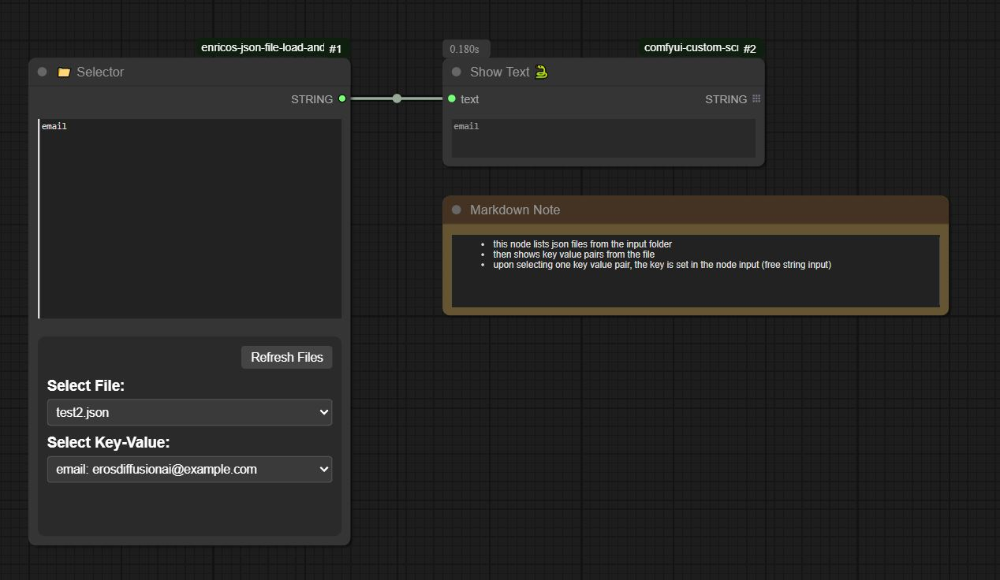

# Select key from JSON (Alpha)

[workflow download ](./example_workflows/demo.png)

## What does this do ?
- this node lists ```json``` files in the ComfyUI ```input``` folder
- shows a dropdown where you can select such a file
- reads the content of the file (key value pairs)
- shows the key/value pair in a dropdown
- when you select the dropdown the "motion" field is populated with the key corresponding to the selection
- when you run the node the text is submitted as output (you can also input free text)

## Install
To install the node via manager 
- open the comfy ui manager popup 
- choose the option "Install via Git URL"
- paste: https://github.com/erosDiffusion/ComfyUI-enricos-json-file-load-and-value-selector.git

## Node Name
search "Selector" from the node list.

### Note
For this to work you need to set
```security_level = weak ```

in 
```<your comfy install folder>\user\default\ComfyUI-Manager\config.ini```

### Alternative install 
with git installed:
```git clone  https://github.com/erosDiffusion/ComfyUI-enricos-json-file-load-and-value-selector.git ```
into your custom nodes folder 

### Example JSON File
it will contain key - value pairs, the key is used as input once selected.
```
{
  "name": "Enrico",
  "age": "old enough",
  "city": "Rome",
  "country": "IT",
  "email": "erosdiffusionai@gmail.com",
  "occupation": "Engineer",
  "hobby": "Comfy",
  "favorite_color": "Purple",
  "pet": "Dragon",
  "status": "Active"
}

```


### Trivia:
- This node uses a custom DOM Widget and custom routes.
- It's created as request from a use in the L2 discord channel from matteo/qubic
- not yet in comfyuimanager
- it's created by telling Claude 3.7 sonnet what to do, with multiple round of "it does not work, fix it" i was just too lazy to read the code, so I have no idea what how it does it (just kidding, I still had to read the code to steer ai to do whatever...)
